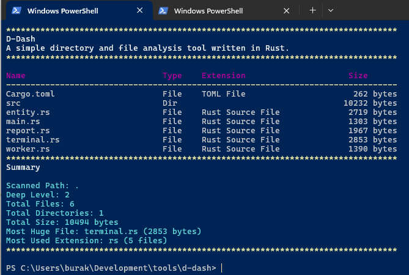

# D-Dash

Bu program, bir klasör içerisindeki dosyalar ve dizinlerle ilgili çeşitli bilgileri renkli formatta terminal ekranına yazdıran bir konsol uygulamasıdır. Rust programlama dili ile yazılmıştır. Amaç, Rust dilinde pratik yapmak ve dosya sistemi ile ilgili bilgileri renkli formatta gösterebilen hafif bir araç oluşturmaktır. Dosya ve dizin bilgilerini çekmek için Rust'ın standart kütüphanesi kullanılmıştır. Terminal çıktısını renklendirmek için ise **`colorized`** kütüphanesi tercih edilmiştir.

```bash
cargo run -- <klasör_yolu>
```

Eğer `<klasör_yolu>` belirtilmezse, program varsayılan olarak geçerli çalışma dizinini kullanır.

## Dilin Kullanılan Özellikleri

- **Enum Tanımları**: Varlığın klasör mü yoksa dosya mı olduğunu belirlemek için `EntityType` enum'u kullanıldı.
- **Struct Tanımları**: `Entity` struct'ı dosya/dizin bilgilerini temsil etmek için kullanıldı.
- **Trait İmplementasyonu**: `Display` trait'i ile özel çıktı formatları tanımlandı.
- **Modül Sistemi**: `mod` ile kod organizasyonu modüler hale getirildi *(entity, report, terminal, worker)*.
- **Result ve Error Handling**: `Result<T, E>` tipi ile güvenli hata yönetimi sağlandı.
- **Pattern Matching**: `match` ifadeleri ağırlıklı olarak enum değerlerini kontrol etmek için kullanıldı.
- **Option Tipi**: `Option<T>` ile çıktı değerlerinin kontrollü bir şekilde ele alınması sağlandı.
- **Iterator Kullanımı**: `iter()`, `map()`, `filter_map()` gibi fonksiyonel programlama teknikleri kullanıldı.
- **Vektör Operasyonları**: `Vec<T>` ile dinamik veri koleksiyonları oluşturuldu.
- **String İşlemleri**: `String`, `&str` dönüşümleri ve manipülasyonları yapıldı.
- **File System API**: `std::fs` ile dosya sistemi operasyonları gerçekleştirildi.
- **Recursive Functions**: Dizin yapısını taramak için özyinelemeli fonksiyonlar kullanıldı.
- **Collections**: `HashSet` ile recursive çağrımda tekrarlanan referanslar engellendi.
- **External Crates**: `colorized` kütüphanesi ile renkli terminal çıktıları oluşturuldu.

## Örnek Ekran Çıktıları

```bash
# Bulunduğumuz klasördeki dosya ve dizin bilgilerini listeleme
cargo run -- .
```


