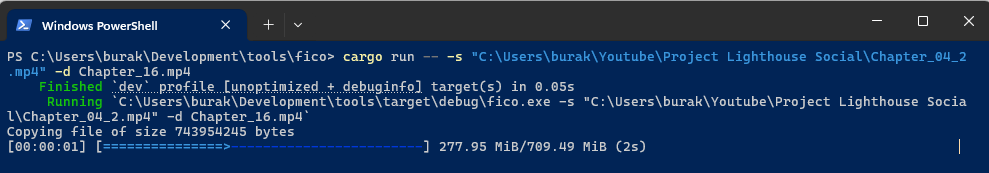
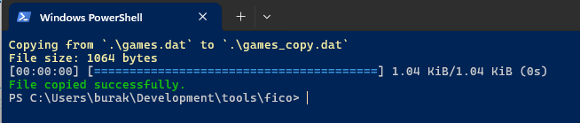

# Fico - Basit Dosya Kopyalama Aracı

Bu terminal uygulaması basit bir dosya koplayama aracıdır. **[Indicatif](https://github.com/console-rs/indicatif)** isimli **crate** kullanılarak kopyalama işlemi sırasında terminalde progress bar gösterimi sağlanır. Özellikle büyük boyutlu dosyaların kopyalanması sırasında bu tip bir görsel bildirim aracı oldukça kullanışlıdır.

## Kullanım

Uygulama kaynak kodundan komut satırı argümanları ile aşağıdaki gibi çalıştırılabilir.

```bash
# Klasik bir dosya kopyalama işlemi
# games.dat isimli dosya aynı klasörde farklı bir isimle oluşturulur
cargo run -- -s .\games.dat -d .\games_copy.dat

# Var olan dosyanın üzerine yazma söz konusu ise bunu --force (-f) argümanı ile belirtebiliriz
cargo run -- -s .\games.dat -d .\games_copy.dat -f
```

## Kullanılan Rust Özellikleri

- **Dosya okuma ve yazma**: `std::fs::File` kütüphanesinden `BufReader`, `BufWriter` kullanılarak okuma ve yazma işlemleri gerçekleştirilir.
- **Buffer Kullanarak Kopyalama**: Dosya kopyalama işlemi sırasında bellek kullanımını optimize etmek için 8 KB boyutunda bir buffer kullanılır.
- **Komut satırı argümanları**: `clap` crate'i kullanılarak komut satırı argümanlarının daha yapısal bir şekilde işlenmesi sağlanır.
- **Progress Bar**: `indicatif` crate'i kullanılarak terminalde kopyalama işlemi sırasında görsel bir progress bar oluşturulması sağlanır. Önemli özelliklerinden birisi template yapısıdır.
- **Hata Yönetimi**: `anyhow` crate'i kullanılarak hata yönetimi ve raporlama işlemleri basitleştirilmiştir.
- **Renkli Terminal Çıktısı**: `colorized` crate'i kullanılarak terminal çıktılarının renklendirilmesi sağlanmıştır.

## Örnek Ekran Çıktıları

Yaklaşık 700 MB boyutundaki bir dosyanın kopyalanması sırasında terminalde aşağıdaki gibi bir çıktı elde edilir:



Işık hızında olan kopyalama işlemi :D *(Renklendirmeler eklendikten sonra)*


