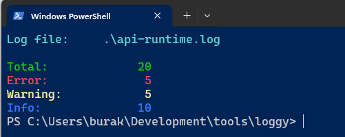
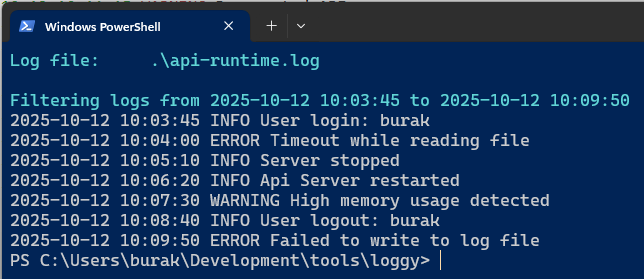
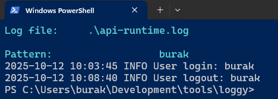
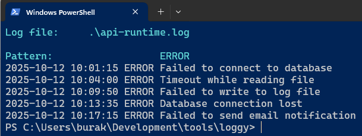
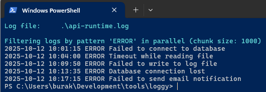
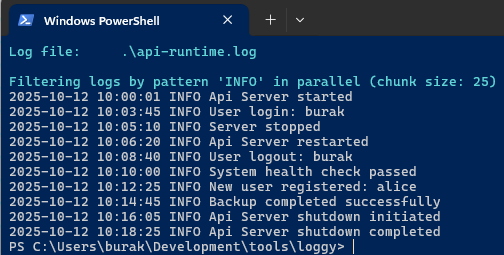
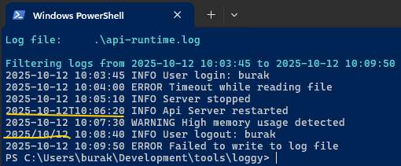
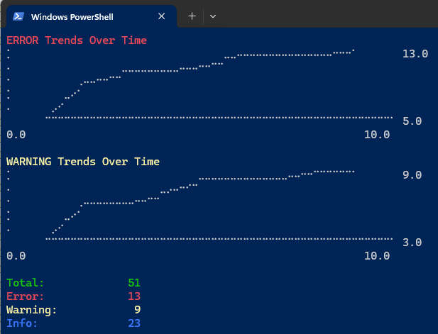

# Loggy - A Simple Log File Analyzer

Loggy, Rust programlama dili ile yazılmış, log dosyalarını analiz etmek ve belirli desenlere göre filtrelemek için kullanılan basit bir terminal uygulamasıdır. Bu araç, log dosyalarındaki belirli kalıpları aramak, gerçek zamanlı log izleme yapmak ve log seviyelerine göre filtreleme gibi işlevleri destekler.

## Özellikler

Komut satırı argümanları ile aşağıdaki gibi kullanılabilir.

```bash
# Log dosyasındaki "ERROR" içeren satırları filtrelemek için:
cargo run -- --file .\api-runtime.log --pattern "ERROR"

# Log dosyasındaki "WARNING" içeren satırları filtrelemek için:
cargo run -- --file .\api-runtime.log --pattern "WARNING"

# Log dosyasını okur ve "burak" isimli kullanıcıya ait logları filtreler
cargo run -- --file .\api-runtime.log --pattern "burak"

# İçinde "Failed to connect" geçen logları bulmak için:
cargo run -- --file .\api-runtime.log --pattern "Failed to connect"

# Logları belirli bir zaman aralığına göre filtrelemek içinse örneğin:
cargo run -- --file .\api-runtime.log --start "2025-10-12 10:03:45" --end "2025-10-12 10:09:50"

# Log dosyasındaki log seviyelerine göre sayım yapmak için:
cargo run -- --file .\api-runtime.log --counts

# Pattern bazlı bir aramayı parallel işletmek için:
# parallel argümanı ile işin paralel olarak yapılacağı belirtilir.
# opsiyonel olan 100 değeri de chunk size'ı belirtir. Yani log satırları 100'erli gruplar halinde paralel işlenir.
cargo run -- --file .\api-runtime.log --pattern "burak" --parallel --chunk-size 100

# Pattern bazlı aramayı parallel işletmek ve varsayılan chunk size'ı kullanmak için:
cargo run -- --file .\api-runtime.log --pattern "ERROR" --parallel

# Log dosyasını gerçek zamanlı izlemek için:
cargo run -- --file .\api-runtime.log --watch
```

> Not: Örnekler devam edecek...

## Kullanılan Rust Özellikleri

- **Regex Kullanımı**: `regex` kütüphanesi log dosyasında belirli desenleri *(içinde ERROR geçenler, `Failed to connect` gibi ifadeler geçenler vs)* aramak için kullanılır.
- **Dosya Okuma**: `std::fs::File` ve `std::io::{BufRead, BufReader}` kullanılarak bir dosya içeriğini satır bazlı okuma işlemleri ele alınmıştır.
- **Error Handling**: `Result` tipi ile hata yönetimi sağlanır. Fonksiyonlar hata durumunda uygun mesajlar döner.
- **Command Line Argument Parsing**: `clap` kütüphanesi ile komut satırı argümanları kolayca işlenir.
- **DateTime İşlemleri**: `chrono` kütüphanesi ile tarih ve saat işlemleri yapılır, logları belirli zaman aralıklarına göre filtrelemek için satır içeriklerindeki tarih ve saat bilgileri parse edilir.
- **Rayon ile Paralel İşleme**: `rayon` kütüphanesi kullanılarak log satırlarının paralel olarak işlenebilmesi özelliği de en azından pattern kullanımına eklenmiştir. Bu sayede büyük log dosyalarına ait filtrelemelerde performans artışı sağlanabilir.
- **Notify ile Dosya İzleme**: `notify` kütüphanesi kullanılarak log dosyasını gerçek zamanlı izleme özelliği eklenmiştir.
- **textplots ile Görselleştirme**: Zaman bazlı log seviyelerinin trendlerini grafiksel olarak terminalde göstermek için kullanılmıştır.
- **MPSC ile Kanal İletişimi**: `Multi Producer Single Consumer (MPSC)` kullanılarak paralel işleme sırasında thread'ler arası veri iletişimi sağlanmıştır.

## Örnek Ekran Çıktıları

Örneklerde kullanılmak üzere aşağıdaki gibi bir log dosyası (`api-runtime.log`) kullanılabilir:

```log
2025-10-12 10:00:01 INFO Api Server started
2025-10-12 10:01:15 ERROR Failed to connect to database
2025-10-12 10:02:30 WARNING Low disk space
2025-10-12 10:03:45 INFO User login: burak
2025-10-12 10:04:00 ERROR Timeout while reading file
2025-10-12 10:05:10 INFO Server stopped
2025-10-12 10:06:20 INFO Api Server restarted
2025-10-12 10:07:30 WARNING High memory usage detected
2025-10-12 10:08:40 INFO User logout: burak
2025-10-12 10:09:50 ERROR Failed to write to log file
2025-10-12 10:10:00 INFO System health check passed
2025-10-12 10:11:15 WARNING Deprecated API usage
2025-10-12 10:12:25 INFO New user registered: alice
2025-10-12 10:13:35 ERROR Database connection lost
2025-10-12 10:14:45 INFO Backup completed successfully
2025-10-12 10:15:55 WARNING CPU temperature high
2025-10-12 10:16:05 INFO Api Server shutdown initiated
2025-10-12 10:17:15 ERROR Failed to send email notification
2025-10-12 10:18:25 INFO Api Server shutdown completed
2025-10-12 10:19:35 WARNING Unusual login activity detected
```

```bash
cargo run -- --file .\api-runtime.log --counts
```



```bash
cargo run -- --file .\api-runtime.log --start "2025-10-12 10:03:45" --end "2025-10-12 10:09:50"
```



```bash
cargo run -- --file .\api-runtime.log --pattern "burak"
```



```bash
cargo run -- --file .\api-runtime.log --pattern "ERROR"
```



```bash
cargo run -- --file .\api-runtime.log --pattern "ERROR" --parallel
```



```bash
cargo run -- --file .\api-runtime.log --pattern "INFO" --parallel --chunk-size 25
```



```bash
# Farklı timestamp formatlarını destekleme özelliği eklendikten sonra
cargo run -- --file .\api-runtime.log --start "2025-10-12 10:03:45" --end "2025-10-12 10:09:50"
```



```bash
# Log dosyasını gerçek zamanlı izleme (tail -f benzeri) özelliği eklendikten sonra
cargo run -- --file .\api-runtime.log --watch
```


