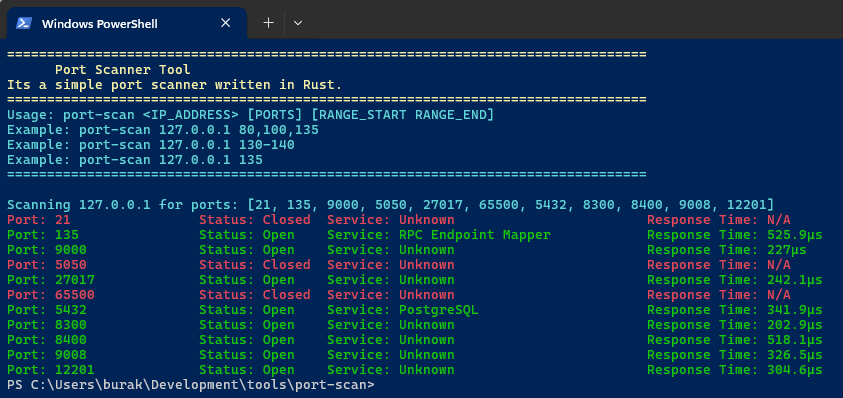
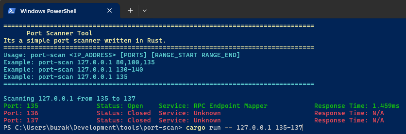
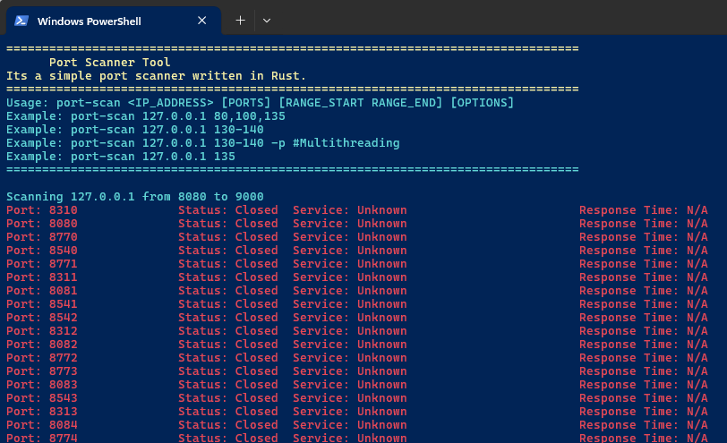

# Port Scanner

Bu uygulama belirtilen IP adresindeki açık portları tarar ve sonuçları kullanıcıya gösterir. Kullanıcı, tek bir port, port aralığı veya virgülle ayrılmış port listesi belirleyebilir.

## Kullanım

```bash
cargo run -- <IP_ADRESI> <PORT|PORT_ARALIGI|PORT_LISTESI> [OPTIONS]

# Örnekler:
cargo run -- 192.168.1.1 80 # Tek bir portu tarama
cargo run -- 192.168.1.1 1000-2000 # Belirli bir port aralığını tarama
cargo run -- 192.168.1.1 22,80,443 # Belirli portları tarama
cargo run -- 192.168.1.1 135-200 -p # Çoklu iş parçacığı kullanarak tarama
```

## Örnek Ekran Çıktıları

```bash
# Belli başlı portları tarama
cargo run -- 127.0.0.1 21,135,9000,5050,27017,65500,5432,8300,8400,9008,12201
```



```bash
# Belirli bir port aralığını tarama
cargo run -- 127.0.0.1 135-137
```



```bash
# Çoklu iş parçacığı kullanarak port aralığını tarama
cargo run -- 127.0.0.1 135-200 -p
```


