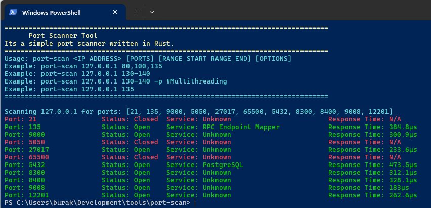
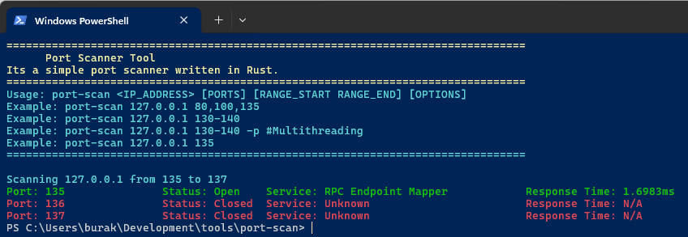

# Port Scanner

Bu uygulama belirtilen IP adresindeki açık portları tarar ve sonuçları kullanıcıya gösterir. Kullanıcı, tek bir port, port aralığı veya virgülle ayrılmış port listesi belirleyebilir.

## Kullanım

```bash
cargo run -- <IP_ADRESI> <PORT|PORT_ARALIGI|PORT_LISTESI> [OPTIONS]

# Örnekler:
cargo run -- 192.168.1.1 80 # Tek bir portu tarama
cargo run -- 192.168.1.1 1000-2000 # Belirli bir port aralığını tarama
cargo run -- 192.168.1.1 22,80,443 # Belirli portları tarama
cargo run -- 192.168.1.1 135-200 -p # Çoklu iş parçacığı kullanarak tarama
```

## Dilin Kullanılan Özellikleri

- **Struct Tanımları**: `Scanner`, `PortInfo` gibi veri modelleri için struct'lar tanımlandı.
- **Enum Kullanımı**: Port durumlarını modellemek için `PortStatus` enum'u kullanıldı.
- **Modül Sistemi**: `mod` ile kod organizasyonu modüler *(models, scanner, screen, worker, tests)* hale getirildi.
- **Result ve Error Handling**: `Result<T, E>` tipi ile güvenli hata yönetimi sağlandı.
- **Option Tipi**: `Option<T>` ile değerlerin varlığı kontrollü bir şekilde ele alındı.
- **Pattern Matching**: `match` ifadeleri ile durum kontrolü yapıldı.
- **Threading**: `std::thread` ile çoklu iş parçacığı *(multi-threading)* kullanılarak port tarama işlemleri yapıldı.
- **Network Programming**: `TcpStream` ile socket bağlantıları kuruldu.
- **Time Operations**: `Duration`, `Instant` ile süre hesaplamaları yapıldı.
- **Iterator Kullanımı**: `split()`, `filter_map()`, `collect()` ile temel string işlemleri yapıldı.
- **Command Line Args**: `std::env::args()` ile terminal argümanları ele alındı ve işlendi.
- **String Parsing**: `parse()` metodları ile tip dönüşümleri yapıldı.
- **Documentation Comments**: `///` ile API dokümantasyonu eklendi.
- **External Crates**: `colorized` kütüphanesi ile renkli çıktılar oluşturuldu.
- **Vector Operations**: `Vec<T>` ile dinamik port listesi yönetimi yapıldı.

## Örnek Ekran Çıktıları

```bash
# Belli başlı portları tarama
cargo run -- 127.0.0.1 21,135,9000,5050,27017,65500,5432,8300,8400,9008,12201
```



```bash
# Belirli bir port aralığını tarama
cargo run -- 127.0.0.1 135-137
```



```bash
# Çoklu iş parçacığı kullanarak port aralığını tarama
cargo run -- 127.0.0.1 135-200 -p
```


