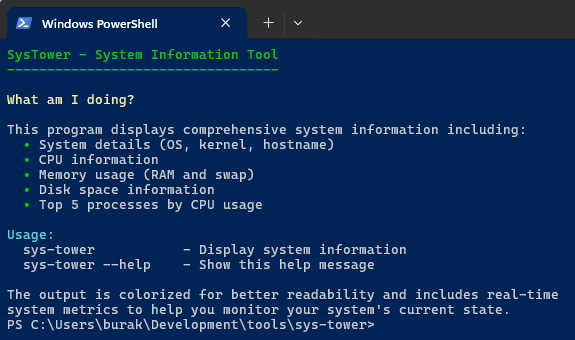
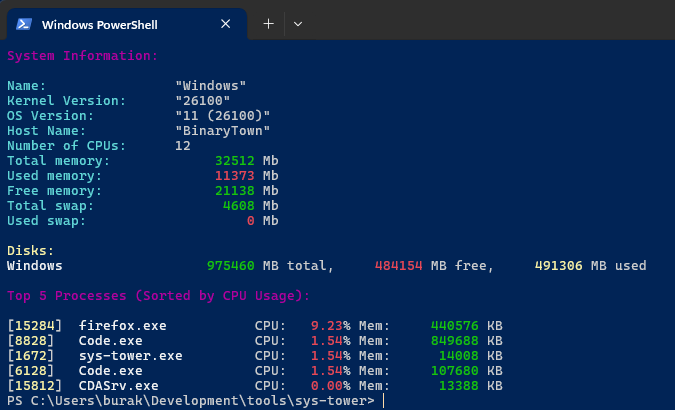

# System Tower

Bu program basit sistem bilgilerini terminal ekranına yazdırır. **Rust** programlama dili kullanılarak, **Windows 11** platformunda geliştirilmiştir. Amaç, **Rust** dilinde pratik yapmak ve sistem bilgilerini renkli formatta gösterebilen hafif bir araç oluşturmaktır. Sistem bilgilerini çekmek için **`sysinfo`** kütüphanesi kullanılmıştır. Terminal çıktısını renklendirmek için ise **`colored`** kütüphanesi tercih edilmiştir. **`sysinfo`** küfesi, sistem bilgilerini erişmek için iyi bir soyutlama *(abstraction)* sunar. Program, CPU, bellek kullanımı, disk durumu ve en çok işlem yapan process bilgilerinden beşini göstermektedir, daha fazlası değil. Kullanımı oldukça basittir; programı çalıştırmak yeterlidir :D

```bash
# Program kaynak kodundan aşağıdaki çalıştırılabilir:
cargo run
cargo run -- --help # Yardım bilgilerini ekrana yazdıracaktır

# Release modunda derleyip çalıştırmak için:
cargo build --release
./target/release/sys-tower
```

## Dilin Kullanılan Özellikleri

- **Struct Tanımları**: Sistem verilerini modellemek için basit struct'lar kullanıldı.
- **Modül Sistemi**: `mod` anahtar kelimesi ile kod organizasyonu modüler hale getirildi *(models, view, utility)*
- **Trait Kullanımı**: `Display` trait'i ile özel davranış *(behavior)* tanımlandı.
- **Iterator Kullanımları**: `iter()`, `map()`, `collect()` gibi basit iterator metodları kullanıldı.
- **Pattern Matching**: `match` ifadeleri ve destructuring işlemleri yapıldı.
- **Error Handling**: `unwrap_or()` ile güvenli hata yönetimi sağlandı.
- **Vektör Operasyonları**: `Vec<T>` ile dinamik diziler ve `sort_by()`, `truncate()` gibi metodlar kullanıldı.
- **String İşlemleri**: `String`, `&str` tipleri ve `to_string()` kullanımları yapıldı.
- **Conditional Compilation**: `cfg!` makrosu ile platforma özel *(Windows veya Linux)* kod yazıldı.
- **External Crates**: `sysinfo`, `colorized` gibi harici kütüphaneleri *(crates)* kullanıldı.
- **Threading**: `std::thread::sleep()` ile thread duraklatmak işlemleri yapıldı.
- **Command Line Args**: `std::env::args()` ile komut satırı argümanlarını okuma işlemleri yapıldı.
- **Documentation Comments**: `///` ile fonksiyon ve struct açıklamaları eklendi.

## Örnek Ekran Çıktıları

```bash
cargo run -- --help
```



```bash
cargo run
```


